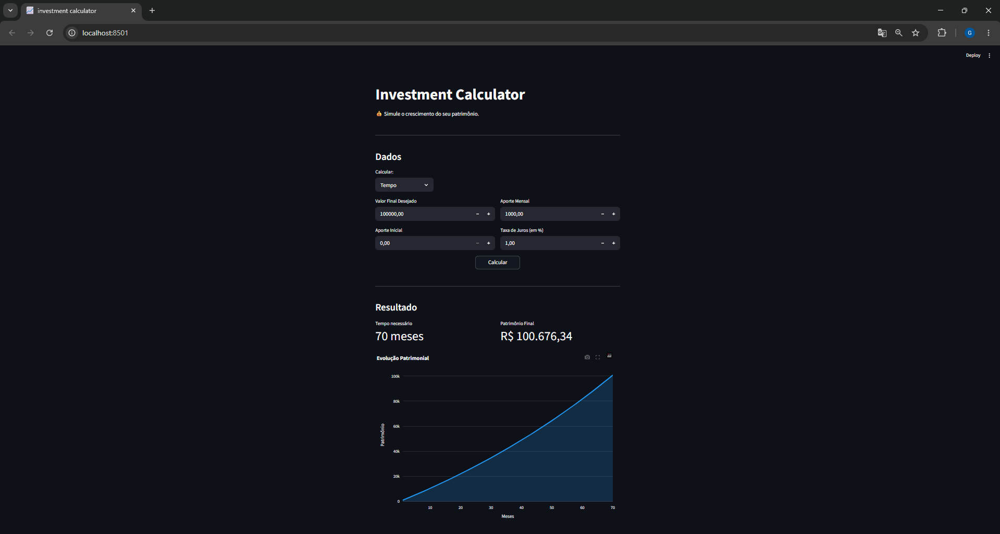

# 📈 Investment Calculator

Simule o crescimento do seu patrimônio com juros compostos. Informe o valor inicial, aportes mensais, taxa de juros e prazo — e veja seu dinheiro crescer no tempo.

## 📸 Screenshot



## ✨ Funcionalidades

- 📊 Simulação de crescimento patrimonial mês a mês
- ⏱️ Calcular quanto tempo para atingir um valor desejado
- 💸 Calcular o aporte mensal necessário para atingir uma meta
- 📈 Gráfico interativo com evolução do patrimônio
- 💰 Valores formatados no padrão monetário brasileiro

## 🛠️ Tecnologias

- [Python](https://www.python.org/)
- [Streamlit](https://streamlit.io/)
- [Plotly](https://plotly.com/python/)

## 📁 Estrutura do Projeto

```
investment-calculator/
│
├── app.py            # Interface com Streamlit
├── calculos.py       # Lógica financeira (juros compostos)
├── utils.py          # Formatação de moeda
├── requirements.txt  # Dependências
└── README.md
```

## 🚀 Como rodar

**1 — Clone o repositório**
```bash
git clone https://github.com/gabrieldosantosribeiro/investment-calculator.git
cd investment-calculator
```

**2 — Crie e ative um ambiente virtual**
```bash
python -m venv .venv

# Windows
.venv\Scripts\Activate.ps1

# Mac/Linux
source .venv/bin/activate
```

**3 — Instale as dependências**
```bash
pip install -r requirements.txt
```

**4 — Rode o app**
```bash
streamlit run app.py
```

O app vai abrir automaticamente em `http://localhost:8501`

## 👨‍💻 Autor

Feito com 💙 como projeto de aprendizado de Python e Streamlit.